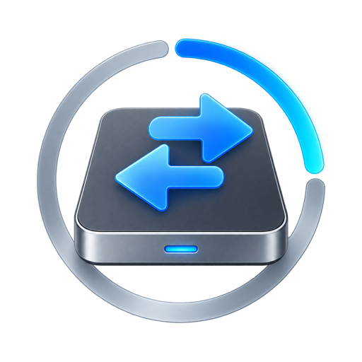

<p align="center">
  
</p>

# USB / SSD Status for DynamicLake

See file transfers to USB drives, external SSDs, and other removable storage directly in DynamicLake.

[](https://github.com/rafaelreverberi/dynamiclake-usb-ssd-status/actions/workflows/build.yml)
[](https://github.com/rafaelreverberi/dynamiclake-usb-ssd-status/releases/latest)
[](LICENSE)
[](https://www.apple.com/macos/)

USB / SSD Status is a local, native Swift JSON plugin for DynamicLake. It combines public macOS progress publications with low-cost filesystem activity and an optional Finder Accessibility fallback. Unknown values remain hidden: the plugin never invents percentages, byte counts, speeds, or ETAs.

## Features

- Compact transfer progress around the notch or Dynamic Island.
- Sneak Peek details for percentage, bytes, throughput, ETA, file count, and current item when macOS provides them.
- Brief connected and disconnected drive notifications with accurate available capacity.
- Multiple concurrent transfers with provider-aware correlation and deduplication.
- Completion, cancellation, failure, and drive-disconnected states.
- Safe eject after confirmed completion; no force unmount and no automatic eject.
- Custom transparent drive artwork optimized for DynamicLake's inline-image limit.
- No persistent activity while idle.
- No telemetry, analytics, account, remote service, or third-party runtime dependency.

## Status

Version 0.1.8 is an early public release. The package, framed JSON transport, lifecycle handling, mount/unmount events, capacity reporting, and Finder-to-removable-drive presentation have been exercised on the development Mac. The broader filesystem/hardware matrix remains documented in [Testing](docs/TESTING.md).

## Installation

1. Download `USB-SSD-Status-0.1.8.dynamiclakeplugin.zip` from the [latest release](https://github.com/rafaelreverberi/dynamiclake-usb-ssd-status/releases/latest).
2. Extract the ZIP archive.
3. Open **DynamicLake → Settings → Plugins → Install Local**.
4. Select `USB-SSD-Status.dynamiclakeplugin`.
5. Leave **Finder Accessibility Fallback** disabled unless the normal providers are insufficient on your Mac.

DynamicLake manages the installed copy. Do not modify files inside the installed package; install a newer release when updating.

## Requirements

- macOS 13 or later.
- DynamicLake Pro or DynamicLake Playground with JSON plugin support.
- An Apple silicon or Intel Mac; the release binary is universal (`arm64` and `x86_64`).
- Xcode/Swift only when building from source.

USB / SSD Status follows DynamicLake's current [JSON Plugin API](https://docs.dynamiclake.com/documentation/dynamiclakekit/jsonpluginapi), [packaging requirements](https://docs.dynamiclake.com/documentation/dynamiclakekit/pluginpackagingandmarket), and [design guidelines](https://docs.dynamiclake.com/documentation/dynamiclakekit/designguidelines).

## How detection works

Provider priority is:

1. **Foundation Progress** — preferred semantic progress when an application publishes it.
2. **Finder Accessibility** — optional numeric progress fallback, disabled by default.
3. **FSEvents** — indeterminate write-activity evidence only; it never fabricates semantic completion.

`TransferCoordinator` correlates matching evidence by destination path, volume, time, and provider quality. Independent high-confidence transfers remain separate. A short preflight operation cannot emit completion unless the same transfer was previously visible as a Live Activity.

See [Architecture](docs/ARCHITECTURE.md) and [Foundation Progress findings](docs/PROGRESS_API_FINDINGS.md) for implementation details and evidence boundaries.

## Permissions

Normal operation requires no root access, sudo, kernel extension, Full Disk Access, or Accessibility permission.

Accessibility is optional and used only by the Finder fallback. The plugin never opens System Settings or prompts for that permission automatically. If enabled, grant access to the installed `usb-ssd-status` executable and restart the plugin.

## Privacy and security

- Processing stays on the Mac.
- No file contents are opened or collected.
- No filesystem data is sent to an external server.
- Labels and transfer statistics go only to DynamicLake through its local Unix-domain plugin socket for rendering.
- Normal logs omit full paths; the explicitly invoked diagnostic probe prints affected URLs.
- `PrivacyInfo.xcprivacy` declares no collection or tracking and includes the disk-space Required Reason API entry used by the optional free-space label.

Please report vulnerabilities privately as described in [Security](SECURITY.md). General usage questions belong in [Support](SUPPORT.md).

## Performance

- Mount changes, FSEvents, Accessibility events, and socket reads are event-driven.
- There is no idle directory crawl.
- Foundation progress polls at 4 Hz only while published progress objects exist.
- Rendering is capped at four updates per second.
- Transfers shorter than 0.75 seconds are suppressed to avoid notch spam.
- The optional diagnostic log is capped at 512 KB.

## Build from source

```sh
git clone https://github.com/rafaelreverberi/dynamiclake-usb-ssd-status.git
cd dynamiclake-usb-ssd-status
./scripts/build-release.sh
```

The command runs the test suite, builds universal Release executables, creates both production and development packages, validates the package folder and archive, executes the framed-socket lifecycle test, and prints the archive SHA-256.

Individual commands:

```sh
swift build
swift test
swift build -c release --arch arm64 --arch x86_64
./scripts/package-plugin.sh
./scripts/check-package.sh dist/USB-SSD-Status-0.1.8.dynamiclakeplugin.zip
```

The deterministic `USB-SSD-Status-Development.dynamiclakeplugin` package emits a synthetic transfer and dismisses itself. It is for host UI testing only, not everyday use.

## Diagnostics

```sh
swift run usb-ssd-status --list-volumes
swift run usb-ssd-status --diagnostics
swift run usb-ssd-status --demo-json
./scripts/run-progress-probe.sh
```

Add `--debug` for bounded local diagnostics. Logs are written to `~/Library/Application Support/DynamicLake/PluginLogs/usb-ssd-status-debug.log`.

## Release verification

Release assets include the installable `.dynamiclakeplugin.zip` and `SHA256SUMS` file. Verify a download with:

```sh
shasum -a 256 -c SHA256SUMS
```

The validator enforces DynamicLake's current limits: 7 MB archive, 20 MB extracted package, 128 KB manifest, square PNG icon no larger than 1.5 MB, 48 KB decoded inline artwork, package-relative executable/resources, a universal signed Mach-O, and no bundled source/debug metadata.

## Known limitations

- Finder's public Progress behavior can differ across macOS releases and operation directions; FSEvents and optional Accessibility provide bounded fallbacks.
- FSEvents observes destination writes and cannot quantify external-to-internal reads.
- Foundation unit counts have no universal byte-unit guarantee. Byte labels appear only when throughput evidence supports that interpretation.
- The JSON plugin presents one foreground transfer while retaining all concurrent transfers internally.
- Finder Accessibility depends on Finder's UI hierarchy and may change after macOS updates.
- Network and NAS volumes are intentionally excluded from the 0.1.x release line.

## Contributing

Contributions are welcome. Read [CONTRIBUTING.md](CONTRIBUTING.md) before opening a pull request. By participating, you agree to follow the [Code of Conduct](CODE_OF_CONDUCT.md).

## License

USB / SSD Status is available under the [MIT License](LICENSE).
